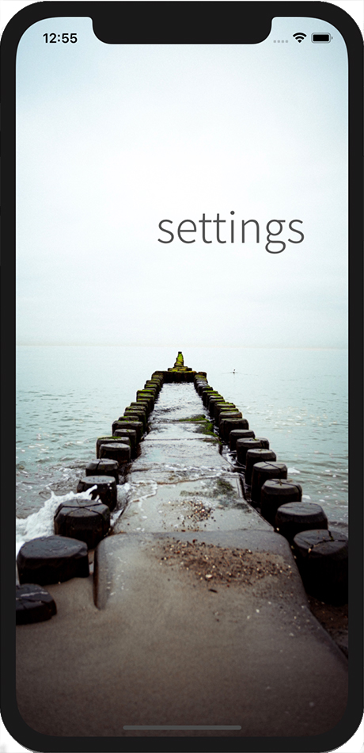
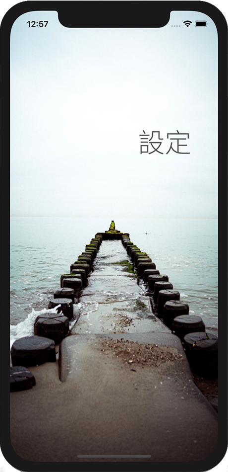

# switch-languages

 

  
  
  

## Overview

Switch Languages helps you discover how to easily add language translation your iOS app and have it applied quickly without having to restart the app.  This demo shows how to implement by way of example from the article [How to programmatically change the app language without restarting the app](https://www.codebales.com/how-programmatically-change-app-language-without-restarting-app)

## Languages

The current list of languages demonstrated in the code include:

- Arabic
- Chinese Simplified
- English
- French
- Hindi
- Japanese
- Russian
- Spanish

If any of the translations are incorrect, please let me know :)

## Getting Started

> This app is not available on the App Store.

### Installation

1. Clone or download the project to your local machine
2. Open the project in Xcode
3. Run the simulator

## Acknowledgements

The following resources were used in the development of this project

Background image is by [Paul Volkmer](https://unsplash.com/photos/wWYZ8zYpZm4)
Nicolas Poincet's Cocoapod Switch Language – [Pod Switch language](https://github.com/NicolasPoincet/SwitchLanguage)

## Author

* **Andrew Fletcher**

## License

This project is licensed under the MIT License - see the [LICENSE](LICENSE.md) file for details
